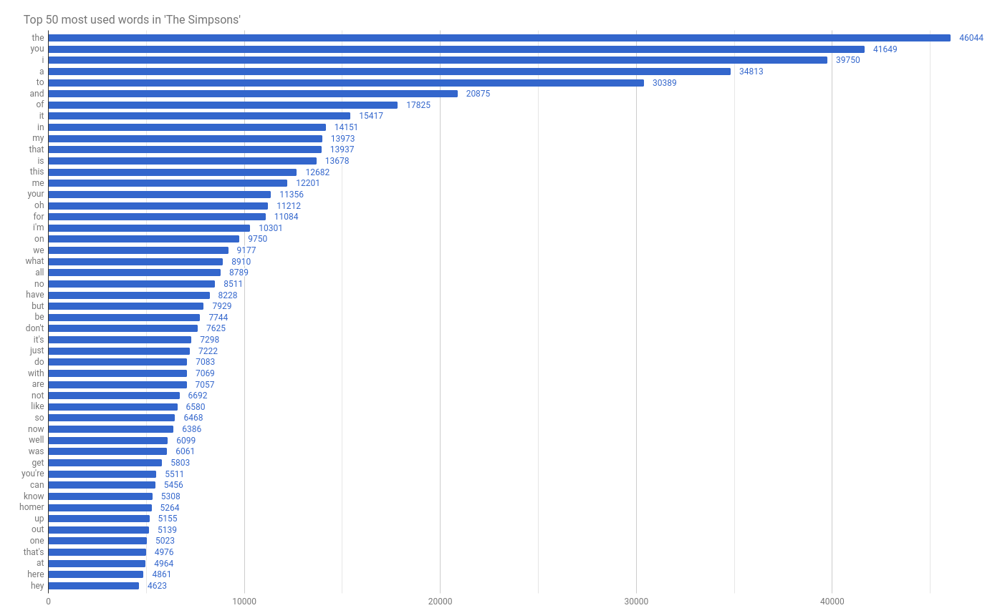
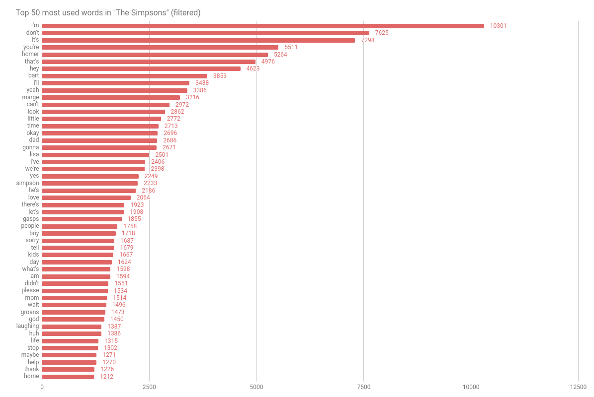

# The Simpsons

Last update of database (17/07/2017).

Source of the scripts used (all credit to them): [SpringfieldSpringfield.co.uk](http://www.springfieldspringfield.co.uk/episode_scripts.php?tv-show=the-simpsons)

I used this website because of it's simplicity and easy to maniupalte HTML pages.

- It uses `requests` for the requests (duh). And `beautifulsoup4` for the HTML manipulation.
- It took about ~13 minutes on my machine (mostly because of bad connection).
- All data is stored as `.csv` files. An word, followed by the number of times it was said.
    - There may be some inconsistency because of some typos in the scripts.
    - The [episodes](episodes) folder contains the words of each episode. It might me interesting make separations by season to see the evolution of the series.

Here is a simple graph that I made with the data. It contains the Top 50 most used words. I've made it by importing the [total_count](total_count.csv) to Google Drive, sorting and selecting the top 50 for a simple histogram.

This is a second graph in which I have filtered stop words that I got from [Lextek](http://www.lextek.com/manuals/onix/stopwords1.html).

